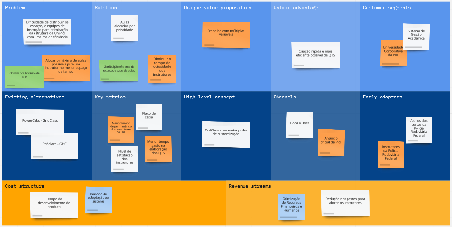

# Lean Canvas

## 🎯 Proposta
Planejamento da aplicação do QTS

> Visualização do Quadro Lean Canvas

## ☕ Usando Lean Canvas
- O que é o Lean Canvas?
Uma das técnicas utilizadas para o planejamento da ideia de uma startup é o quadro Lean Canvas. Esta é uma ferramenta baseada no Business Model Canvas (Quadro de Modelo de Negócios), cuja função principal é desenvolver modelos de negócios novos ou existentes.
- Links
  - Site: [Lean Canvas](https://miro.com/pt/modelos/lean-canvas/)
  - Lean Canvas do Projeto: [Lean Canvas QTS](https://miro.com/app/board/uXjVP2wiVHM=/)

[⬆ Voltar ao topo](#lean-canvas)
